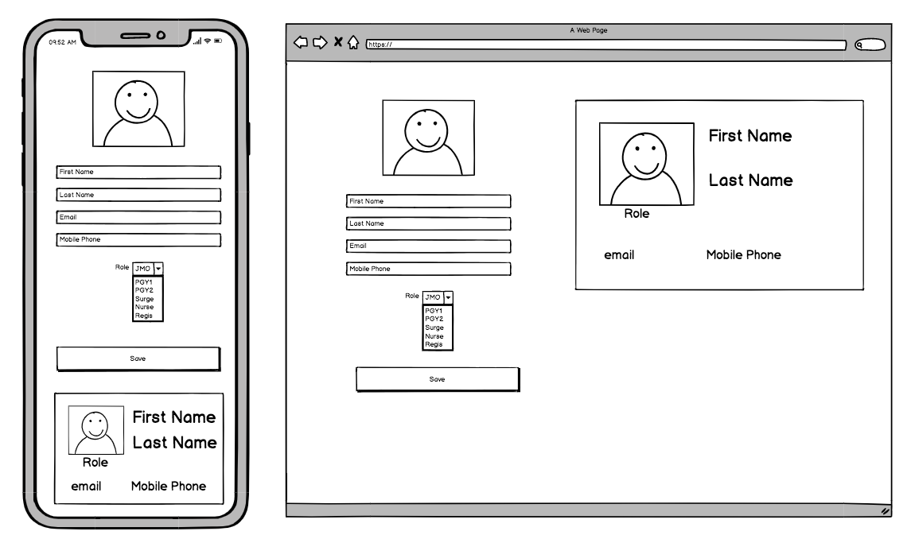

# react-app

### Requirements

- Create a form complete with live preview of the users details 
- Email address is validated and every field is required
- The app should be responsive to work on a mobile device

Allow the app to use the filesystem api to read a local file for drag and drop. To then be displayed in an image preview.

Submitting the form at this initial stage is not necessary, ensure the data is valid so that it can be wired up with a backend.

### Running the app
1. To start the application, `cd app/` 
2. Run `npm install` which will install the requirements and packages needed by the app.
3. Run `npm start` will open a new window that will display the application. 
